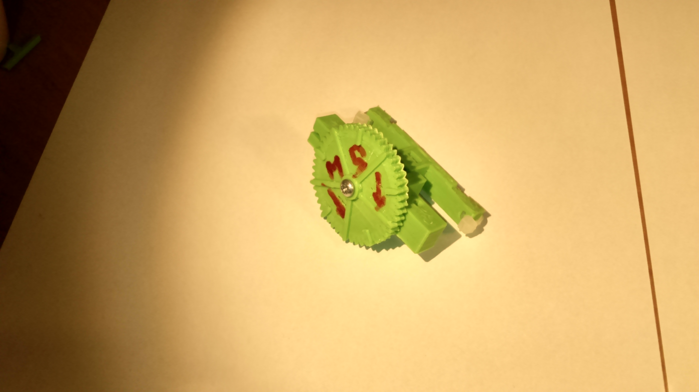
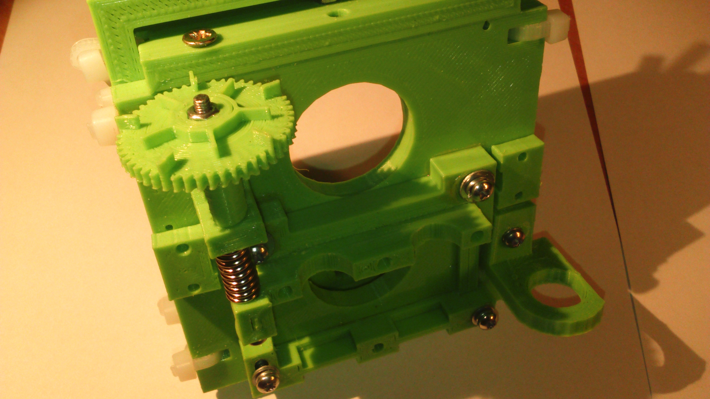
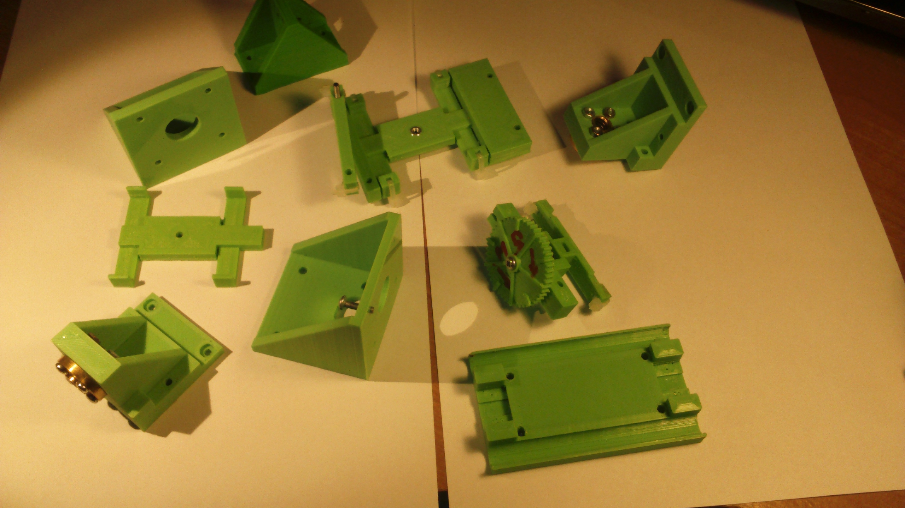
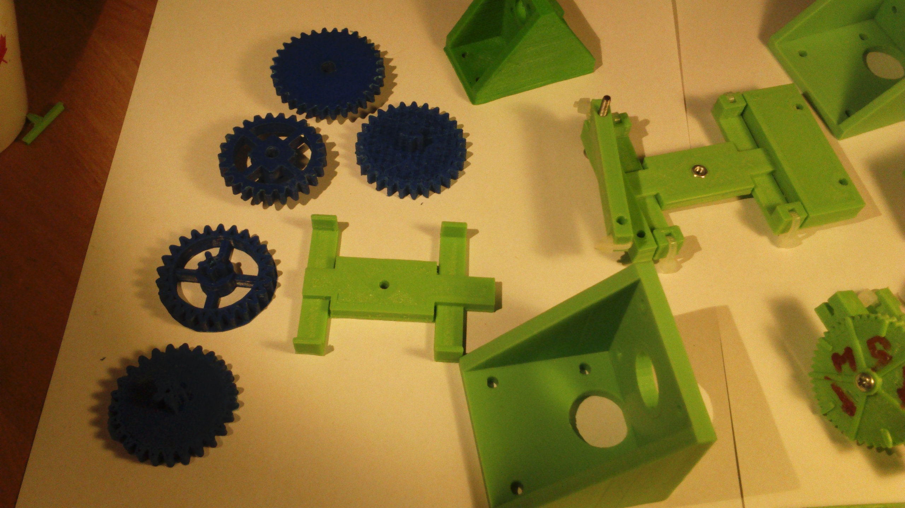

# Drukarki 3D

* https://leszekwitucki.github.io/green3Dprint[Moje portfolio]

## Moje hobby

= projektowanie elementów drukarki 3D w programie 'Sketchup Make'

Zaprojektowane przeze mnie drukarka działa, lecz wciąż jest udoskonalana.

## O nazwie strony

Zielony jest moim ulubionym kolorem wydruków - stąd pomysł na nazwę strony.

## Zdjęcia

## Usługi

|===
| Wyszczególnienie	|  kwota
| Minimalna cena	| 20 zł
| Godzina druku | 20 zł
| 1 cm^3^ przepływu materiału | 1 zł
| 1 gram ABS lub PLA | 0,10 zł
| Inne materiały | indywidualnie
|===
Tabela. 1. Cennik usług

## Zastosowania Druku 3D

* [x] <https://www.optima-md.com/blog/drukarka-3d-zastosowanie-jak-dziala-projekty-z-cukru-eksploatacja,468,1.html>
* [x] <http://www.akademiaprodukcji.pl/zastosowanie-drukarek-3d/>
* [x] <https://drukarki3d.pl/zastosowania/>
* [x] <http://drukw3d.com/zastosowanie-druk-3d/>

## Korzyści z posiadania drukarki 3D:

** Posiadanie orginalnych przedmiotów.
** Praktyczne zastosowanie wydruków w domu.
** Spersonalizowane prezenty dla innych.
** Nauka projektowania w parktyce.
** Duma z samodzielnie zaprojektowanego przedmiotu. 
